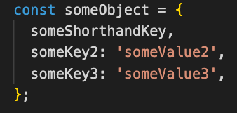
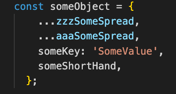
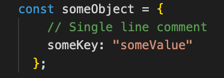

# JavaScript Sort

Visual Studio Code extension to deeply sort the keys within a JavaScript object.

## Features

### Object Property Value Shorthand

Object Property Value Shorthand keys can be sorted along with traditional key/value pairs.

### Spread Operator

Spread Operators are assumed to be the first keys in an object and will be left in their original position.

### Single Line Comments

Single line comments will be kept with the following key.

## Requirements

No requirements.

## Known Issues

Inline and multiline comments are not currently supported

## Release Notes

### 0.0.1

Initial release

---

**Enjoy!**
